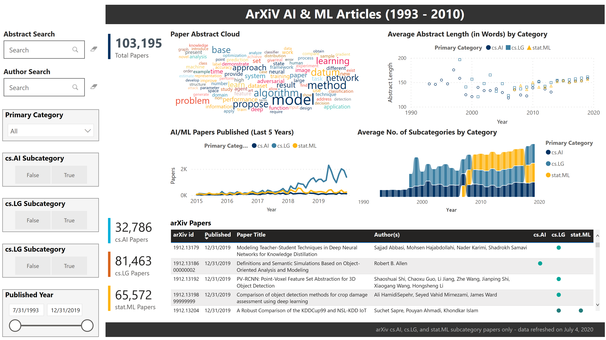

arXiv.org AI/ML Analysis
==========================================================

        

#### Authors : [Rahul Kulkarni](https://www.linkedin.com/in/rahul-kulkarni-6544545/) | [Anu Yadav](https://www.linkedin.com/in/anuyadav1/) | [Cristopher Benge](https://cbenge509.github.io/)

U.C. Berkeley, Masters in Information & Data Science program - [datascience@berkeley](https://datascience.berkeley.edu/)  
Summer 2020, W209 - Data Visualization - [Andrew Reagan, PhD](https://www.linkedin.com/in/andyreagan/) - Section 4

---

## Description

This repo contains the draft work for the visualization of AI/ML research papers catalogued on [arXiv.org](https://arxiv.org/) for calendary years 1993 through 2019.  Categories under consideration have been limited to:

 - Computer Science: Artificial Intelligence [``cs: AI``]
 - Computer Science: Machine Learning [``cs: LG``]
 - Statistics: Machine Learning [``stat: ML``] 

There are two external visuals for this project:
 * [Bokeh ArXiV Paper Clustering Visual](https://victorious-plant-0cdd0420f.azurestaticapps.net/) (hosted in Azure Web App)
 * [Power BI ArXiV Paper Dashboard](https://msit.powerbi.com/groups/me/reports/faa917b2-afde-40ff-b5d9-6e8eaf7c3cf9?ctid=72f988bf-86f1-41af-91ab-2d7cd011db47) (requires access grant and Power BI login)

---

This project leverages the following visualization frameworks:

 * [Matplotlib](https://matplotlib.org/)
 * [Seaborn](https://seaborn.pydata.org/)
 * [Altair](https://www.altair.com/)
 * [Plotly](https://plotly.com/python/)
 * [Bokeh](https://docs.bokeh.org/en/latest/index.html)
 * [Power BI](https://powerbi.microsoft.com/en-us/)
 * [Tableau](https://www.tableau.com/)

---

#### Highlight of key files included in this repository:

  |File | Description |
  |:----|:------------|
  |[ArXiV AI & ML Analytics - Midterm.pptx](presentations/midterm/ArXiV%20AI&%20ML%20Analytics%20-%20Midterm.pptx)| Midterm presentation for arXiv AI & ML Analysis solution |
  |[w209_assignment_2__cris_benge.pdf](reports/a2/w209_assignment_2__cris_benge.pdf)| Assignment 2, covering thorough review and initial hypothesis testing of arXiv data. |
  |[load_base_data.py](load_base_data.py)| Processes the base arXiv categories data, storing the output into a single Pandas.DataFrame (HDF5 file) |
  | [refine_data_for_analysis.py](refine_data_for_analysis.py) | Processes the consolidated (but raw) arXiv categories data, generating the final analysis output data (CSV file) |
  |[utils/preprocessing.py](utils/preprocessing.py)| Utility class; used for loading the raw arXiv data and generating the processed analysis dataset |
  |[plot_utils.py](utils/plot_utils.py)| Utility class; used for generating various plots in EDA |
  |[Exploratory Data Analysis.ipynb](Exploratory%20Data%20Analysis.ipynb)| Jupyter Notebook demonstrating the basic exploratory data analysis performed |
  |[Clustering and Topic Modeling.ipynb](Clustering%20and%20Topic%20Modeling.ipynb)| Jupyter Notebook containing the walk-through for clustering and topic modeling of the arXiv dataset |

---

## Visualization Samples

 

 

---

## References

Data was collected from the tremendous work provided by the [arxiv_archive](https://github.com/staeiou/arxiv_archive/) repo and all due credit is referred to:   ``Geiger, R. Stuart (2020). ArXiV Archive: A Tidy and Complete Archive of Metadata for Papers on arxiv.org.`` [doi](10.5281/zenodo.1463242) | [url](http://doi.org/10.5281/zenodo.1463242).

---

License
-------
Licensed under the MIT License. See [LICENSE](LICENSE) file for more details.
